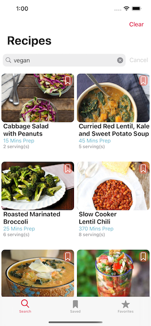

# My Recipe Box (MVP in Progress)

## Overview
- A native Swift iOS application implementing UIKit. Utilizing Swift 5 and Xcode 12.
- Recipes are fetched from the Spoonacular Recipe API: https://spoonacular.com/food-api.

## Current Updates
- As of March 8, 2021, refactoring the app to be App Store ready.
- Projected launch date May 2021.
- Currently working on updating the recipe's detail screen.

## Screenshots

