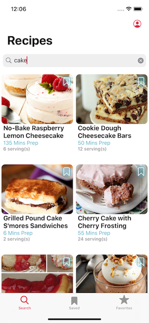

# My Recipe Box (MVP in Progress)

## Overview
- A native Swift iOS application implementing UIKit. 
- Recipes are fetched from the Spoonacular Recipe API: https://spoonacular.com/food-api.

## Current Updates
- As of March 8, 2021, refactoring the app to be App Store ready.
- Projected launch date May 2021.

## Screenshots
 

## Language
Swift 5.3

## Third-Party Frameworks
- Firebase/Auth
- Firebase/Firestore
- Firebase/Storage

## Development Tools
- Xcode 11
